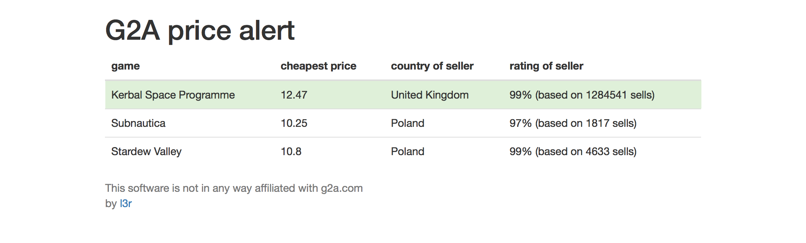

# Chames
as in **ch**eap g**ames**, a small web application to watch the prices of your favourite games on [G2A](https://www.g2a.com)

## Features
- sends you notification emails when a game is available for a specific price or cheaper with informations about the seller (after sending that email the alert for this game is disabled and can be enabled again from the overview page)
- an overview website for adding and deleting games

## Requirements
- PHP >= 5.4.0
- a webserver that supports `.htaccess` files
- a way to execute a script regularly (like cron or runwhen)

## Setup
1. go to `setup.php` with your browser and copy the configuration generated into `config.php`
2. change the other options in in `config.php` according to your needs
3. create a cronjob or something similar to execute `notifications_check.php` regularly (e.g. every day)
3. Enjoy!

## Powered by
g2a API, [REST Countries](https://restcountries.eu), [Bootstrap](http://getbootstrap.com)

## License

Chames is licensed under the MIT License

----
This software is not in any way affiliated with g2a.com.  
Author: lx4r (<https://l3r.de>)  
and awesome contributors: [jburg88](https://github.com/jburg88), [solygen](https://github.com/solygen), [m-villalilla](https://github.com/m-villalilla)

If you have a question regarding Chames or if you want to give me feedback about my code please don't hesitate to contact me [via Twitter](https://twitter.com/lx4r).

The code of this project is 100% biodegradable and was written on happy keyboards.
